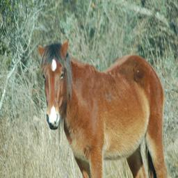
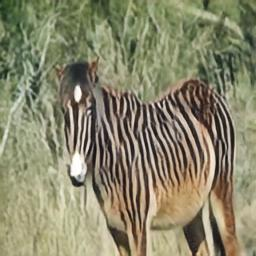
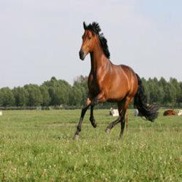
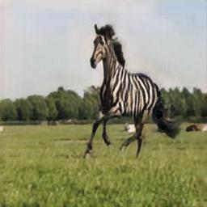
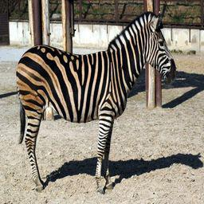
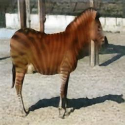
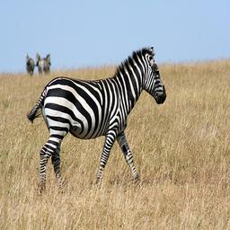
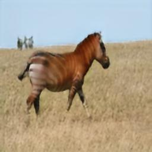

PyTorch CycleGAN
================

PyTorch implementation of CycleGAN.

Paper: Unpaired Image-to-Image Translation using Cycle-Consistent Adversarial Networks https://arxiv.org/abs/1703.10593

Changes to the original paper:

* Prevents checkerboard artifacts in output images by using upsampling instead of deconvolution, see https://distill.pub/2016/deconv-checkerboard/

A good introduction on how to implement a cycle-gan (and how it works) can be found in this blog post: https://hardikbansal.github.io/CycleGANBlog/


Install
-------

```
git clone github.com/martno/cyclegan-pytorch
cd cyclegan-pytorch
pip3 install -r requirements.txt
```

Install latest PyTorch: http://pytorch.org/
e.g.
```
pip3 install pip3 install http://download.pytorch.org/whl/cu80/torch-0.3.0.post4-cp35-cp35m-linux_x86_64.whl
pip3 install torchvision
```

Download and extract horse-to-zebra dataset:
```
wget https://people.eecs.berkeley.edu/~taesung_park/CycleGAN/datasets/horse2zebra.zip
unzip horse2zebra.zip
```


Run
---

### Train

Train with CUDA (recommended):

`python3 train.py --dataset_a=horse2zebra/trainA --dataset_b=horse2zebra/trainB --use_cuda`

Train without CUDA:

`python3 train.py --dataset_a=horse2zebra/trainA --dataset_b=horse2zebra/trainB`


### Evaluate

`python3 test.py --dataset_a=horse2zebra/testA --dataset_b=horse2zebra/testB`

(add `--use_cuda` to evaluate with CUDA)


### Show usage

```
python3 train.py --help

Usage: train.py [OPTIONS]

Options:
  --dataset_a PATH                Path to dataset A
  --dataset_b PATH                Path to dataset B
  --use_cuda / --no_cuda          [default: False]
  --checkpoint_path TEXT          Checkpoint path  [default: checkpoint]
  --save_step INTEGER RANGE       Save every `--save_step` step  [default:
                                  100]
  --test_step INTEGER RANGE       Test every `--test_step` step  [default:
                                  100]
  --batch_size INTEGER RANGE      Batch size  [default: 1]
  --image_pool_size INTEGER RANGE
                                  Image pool size  [default: 50]
  --adam_beta1 FLOAT              Adam optimizer's beta1 param  [default: 0.5]
  --adam_beta2 FLOAT              Adam optimizer's beta2 param  [default:
                                  0.999]
  --gen_learning_rate FLOAT       Learning rate for generators  [default:
                                  0.0002]
  --discr_learning_rate FLOAT     Learning rate for discriminators  [default:
                                  0.0001]
  --log_filename TEXT             Log filename  [default: log.csv]
  --debug_path TEXT               Folder to save debug images  [default:
                                  debug]
  --help                          Show this message and exit.
```

```
python3 test.py --help

Usage: test.py [OPTIONS]

Options:
  --dataset_a PATH        Path to dataset A
  --dataset_b PATH        Path to dataset B
  --use_cuda / --no_cuda  [default: False]
  --checkpoint_path PATH  Checkpoint path  [default: checkpoint]
  --test_save_path TEXT   Folder to save test images  [default: test-output]
  --help                  Show this message and exit.
```


Results
-------

### Horse to zebra

 

 


### Zebra to horse

 

 


Notes
-----

Sometimes the training starts with inverting the colors of the input image. If this happens, the training will get stuck in this state.
Restart the training until it doesn't invert the colors.
(During training, output images are saved in the folder `debug`. Check this folder to see if the images are inverted or not.)

